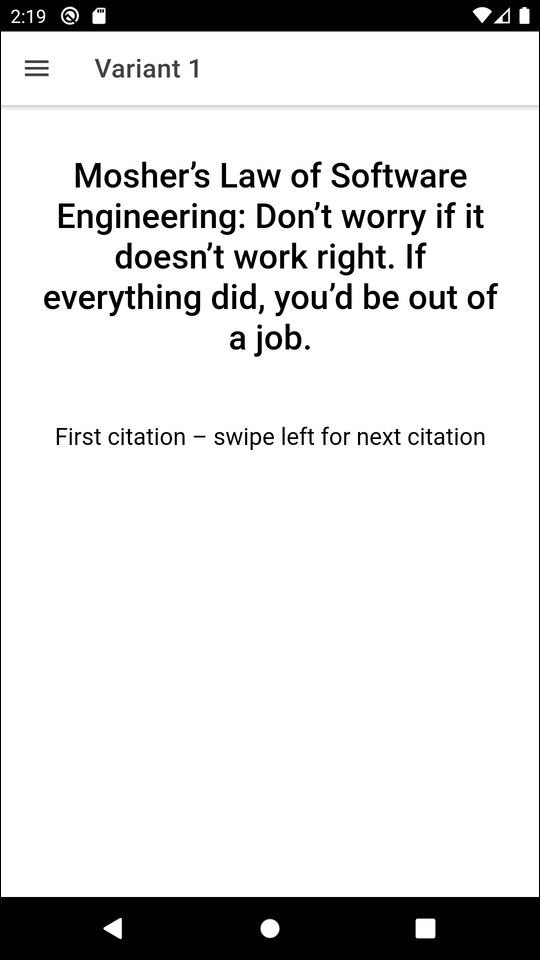
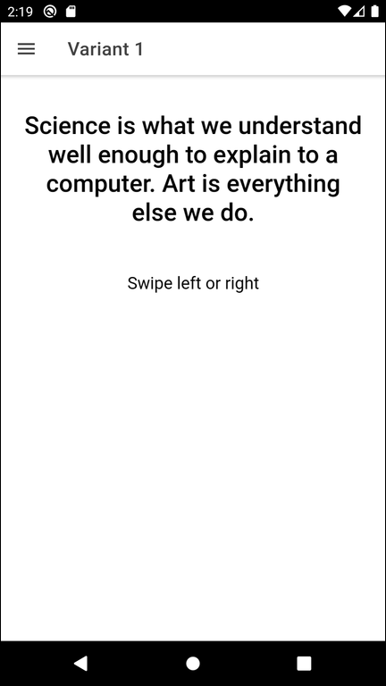
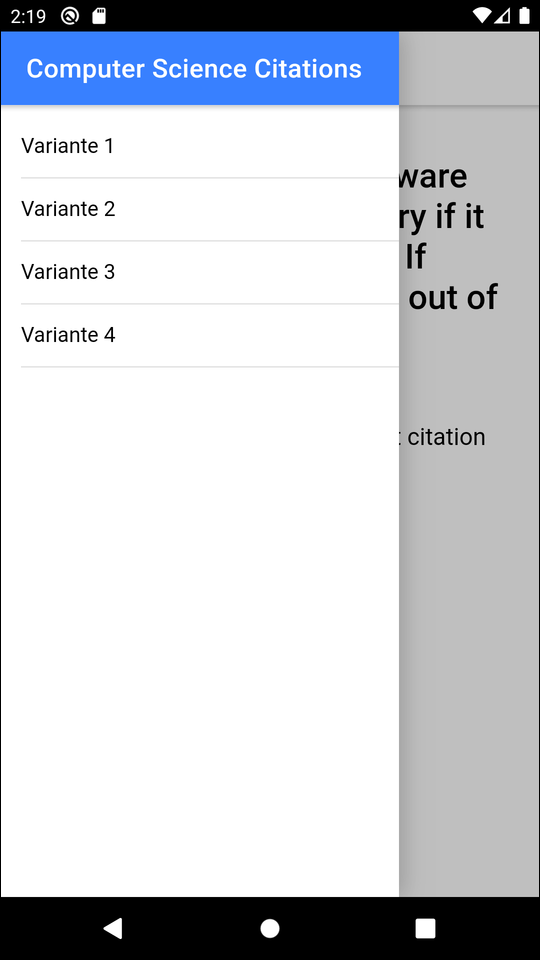
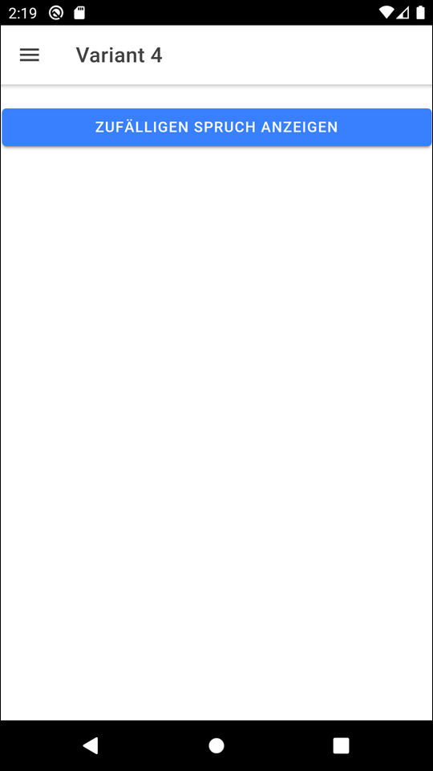
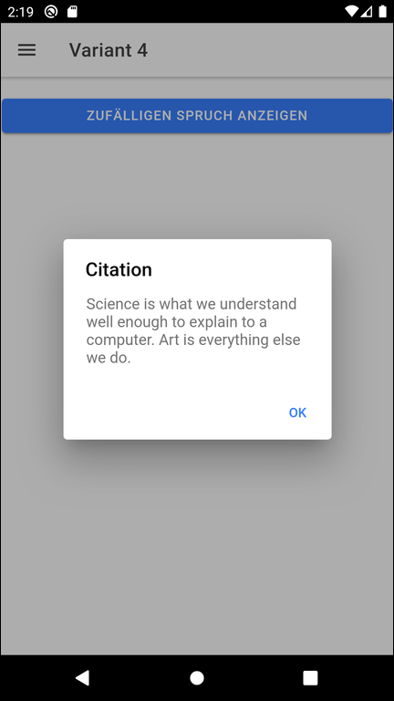

# Ionic app to demonstrate translation of UI texts #

<br>

This repository contains an Angular-based Ionic app that shows some citations from the area of computer since in
[ion-slides](https://ionicframework.com/docs/api/slides) elements.
These citations and the few other texts in the app are translated to German and Englisch, whereas the latter is the default language.
For the translatable texts Angular's translation library [ngx-translate](https://www.npmjs.com/package/@ngx-translate/core) is used.

<br>

----

## Screenshots ##

<br>

  

  



<br>

----

## Implementation Details ##

<br>

The English texts can be found in file [src/assets/i18n/en.json](src/assets/i18n/en.json),
the German  texts can be found in file [src/assets/i18n/de.json](src/assets/i18n/de.json).

The translation was implemented according to the following article: https://phrase.com/blog/posts/localizing-ionic-applications-with-ngx-translate/

First the following NPM modules have to be added to the Ionic project:
```
npm install @ngx-translate/core @ngx-translate/http-loader --save
```

To enable translation in the Ionic app some changes are needed in files [src/app/app.component.ts ](src/app/app.component.ts) and [src/app/app.component.ts](src/app/app.component.ts) for setting the default lanuage (`ngx-translate` is for Angular, i.e. not Ionic-specific).

In HTML files you can reference a translated text using the `translate` pipe:
```
{{ "key_for_text" | translate }}
```

To enable the `translate` pipeline in a HTML file class `TranslateModule` must be exported in the corresponding `.module.ts` file for each page in which this pipe is to be used, for example file [src/app/home/home.module.ts](src/app/home/home.module.ts).

Here is another article describing how to have translatable texts with parameters: https://vitamindev.com/angular/how-to-use-parameters-in-ngx-translate/

<br>

----

## License ##

<br>

See the [LICENSE file](LICENSE.md) for license rights and limitations (BSD 3-Clause License) for the files in this repository.

<br>
